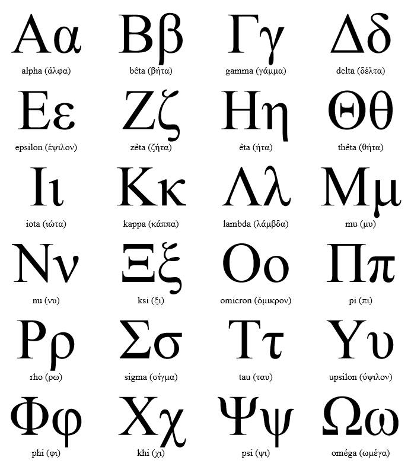

## Base
- https://fr.wikipedia.org/wiki/Usage_des_lettres_grecques_en_sciences
- https://fr.wikipedia.org/wiki/Th%C3%AAta
- https://fr.wikipedia.org/wiki/Table_de_symboles_math%C3%A9matiques
- https://fr.wikipedia.org/wiki/Coordonn%C3%A9es_polaires

## Autres
- https://fr.wikipedia.org/wiki/Nombre_complexe
- https://fr.wikipedia.org/wiki/Mandelbulb
- https://fr.wikipedia.org/wiki/Num%C3%A9ration_grecque
- https://www.w3schools.com/charsets/ref_utf_math.asp
